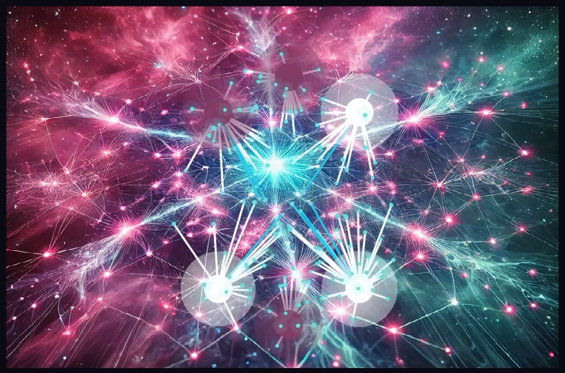
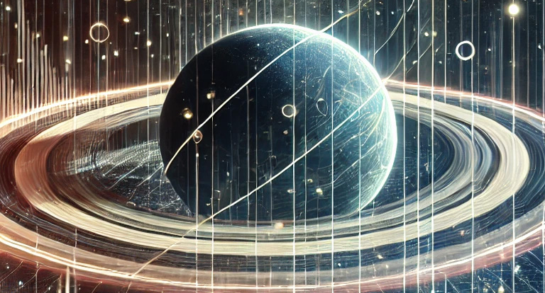
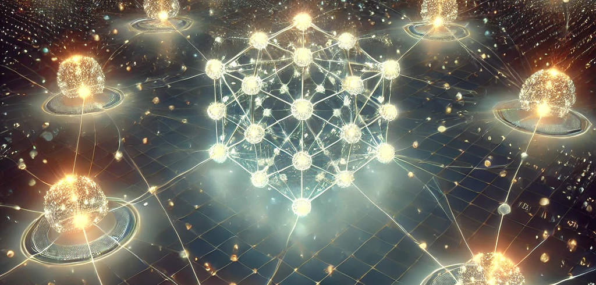
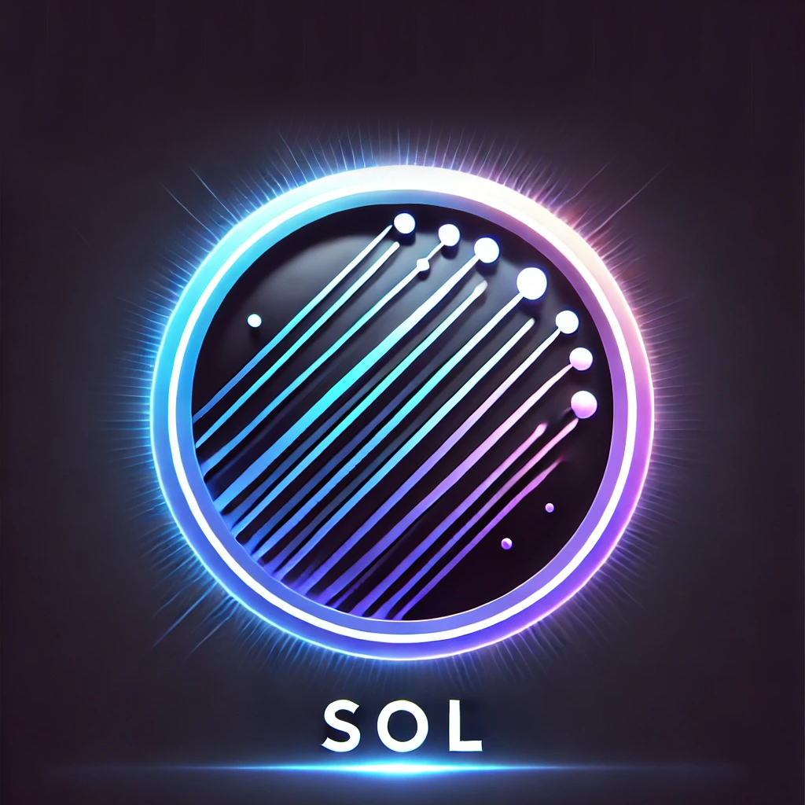

# SoL Gravitas

**Dynamic Gravitational Simulation with Gravitational Averaging (GA) and Biomimetic Gravitational Averaging (BGA)**

---

## Overview

SoL Gravitas is a cutting-edge simulation tool that visualizes complex gravitational systems using advanced computational models. By leveraging principles like **Gravitational Averaging (GA)** and **Biomimetic Gravitational Averaging (BGA)**, the simulation produces dynamic, realistic behaviors that mimic cosmic phenomena such as planetary formation, swarm behavior, and distributed systems.

The visualization offers a glimpse into how gravitational mechanics, when properly averaged and balanced, can drive emergent behaviors that scale from micro-interactions to large-scale cosmic equilibrium.

---

## Key Features

- **Dynamic Node Interaction:** Visualizes how smaller Dynamic Nodes (DNs) interact with larger Primary Mass Nodes (PMNs) based on gravitational forces.
- **Gravitational Averaging (GA):** Smooths gravitational influence across multiple PMNs, creating natural, emergent behavior that mimics orbital mechanics.
- **Biomimetic Gravitational Averaging (BGA):** Introduces mass and distance weighting to create more realistic, adaptive gravitational interactions.
- **Filament Visualization:** Displays dynamic filaments representing gravitational connections and data pathways between nodes.
- **Interactive Controls:** Add or remove nodes, adjust mass, velocity, and toggle collision mechanics in real-time.
- **Sophisticated Collision Response:** Implements elastic collisions between nodes to simulate realistic mass interactions.



---

## Gravitational Averaging (GA)

**Gravitational Averaging (GA)** ensures that each node's gravitational pull is not dominated by a single mass but is instead an aggregate of all surrounding PMNs. This creates smoother and more natural motion, preventing erratic behaviors and chaotic system collapses.

Mathematically, this is achieved by distributing the gravitational force across multiple nodes proportionally to their mass and distance:

```
F_total = \sum_{i=1}^{n} \frac{G * m_1 * m_i}{d_i^{2}}
```

Where:
- `G` is the gravitational constant.
- `m_1` is the mass of the Dynamic Node.
- `m_i` is the mass of the i-th Primary Mass Node.
- `d_i` is the distance between the Dynamic Node and the i-th PMN.

This smooth distribution prevents single PMNs from dominating and enables nodes to interact more naturally.

---

## Biomimetic Gravitational Averaging (BGA)

**Biomimetic Gravitational Averaging (BGA)** refines GA by introducing mass-distance weighting, ensuring that larger masses have a proportionally larger influence while accounting for proximity. This prevents distant, massive nodes from exerting excessive force compared to nearer, smaller nodes.

**Formula:**

```
F_weighted = \frac{\sum_{i=1}^{n} \left( \frac{m_i}{d_i} * F_i \right)}{\sum_{i=1}^{n} \frac{m_i}{d_i}}
```

This ensures that nodes find natural equilibrium zones between competing gravitational sources, leading to:
- **Stable Orbital Dynamics**
- **Realistic Swarm Behavior**
- **Adaptive Gravitational Influence**



---

## Gravitas Recommendation Engine Protocol (GREP)

Gravitas (GREP) is a temporal system, meaning it processes recommendations and matches based on dynamic, real-time interactions rather than static datasets. This temporal nature offers both advantages and challenges, which merit discussion to provide a holistic view of its capabilities.

**Positives of Temporal Processing**

**Adaptability**: Gravitas can adjust on-the-fly to changing datasets or user preferences. In a recommendation system like GREP, this means adapting recommendations to match evolving user inputs and system conditions without requiring complete recalculations.

**Fair Load Distribution**: By leveraging controlled probabilistic randomness, Gravitas avoids static hierarchies where top-ranked entities consistently dominate. This allows for fairer distribution and prevents the "rich get richer" dynamics prevalent in many ranking systems.

**Responsive Interaction**: Temporal systems align naturally with use cases where immediacy is critical, such as dating apps or real-time processing queues. They deliver recommendations that feel timely and personalized.

**Challenges of Temporal Processing**

**Computational Overhead**: Continuous updates and dynamic interactions require significant computational resources, especially as the dataset scales. While GREP reduces this by limiting drawn elements and leveraging gravitational averaging, there remains a practical limit to what can be visualized and processed simultaneously.

**Transient States**: Temporal systems inherently prioritize the "now," which can lead to fleeting recommendations that may not always reflect longer-term patterns or preferences. Balancing immediate responsiveness with broader insights is an ongoing consideration.

**Scalability**: Temporal systems face limitations when managing vast datasets in real-time, especially when visualizing or simulating dynamic interactions. Techniques like reducing drawn nodes or integrating with traditional AI methods can mitigate these constraints.

Gravitas, with its temporal foundation, represents a shift from static recommendation paradigms to dynamic, adaptive systems. While it introduces unique complexities, its ability to model chaotic yet organized systems like gravitational mechanics offers a compelling alternative to traditional AI-driven approaches.


[Or watch the video on YouTube](https://youtu.be/XEB_d5aLHbE?si=zrzj2Md8dj1x_xqF)

## Installation

1. **Clone the Repository:**
```bash
git clone https://github.com/your-username/gravitas.git
cd gravitas
```

2. **Install Dependencies:**
```bash
pip install -r requirements.txt
```

3. **Run the Simulation:**
```bash
python main.py
```

---

## Controls

- **Add Dynamic Node (DN):** Adds a smaller, mobile node.
- **Add Primary Mass Node (PMN):** Adds a larger gravitational node.
- **Mass Slider:** Adjusts the mass of newly created nodes.
- **Velocity Slider:** Adjusts the starting velocity of nodes.
- **Enable/Disable Collisions:** Toggles collision detection between DNs and PMNs.
- **Start Simulation:** Begins the gravitational simulation.

---

## Future Roadmap

- **Adaptive Gravitational Filaments:** Introduce dynamic adjustment of filament strength based on system load (ideal for computational models).
- **Resource Queueing Systems:** Implement repulsion mechanisms to mimic load balancing in distributed computing.
- **Real-Time Parameter Adjustment:** Sliders to adjust gravitational constants, softening factors, and force limits during simulation.

---

## License

This project is licensed under non-commercial License. See the [LICENSE](LICENSE) file for details.

---

## Acknowledgments

This project is inspired by astrophysical phenomena and theoretical models of gravitational systems, adapted for interactive simulation and computational visualization.

---

## Contact

For questions, contributions, or collaborations:
- **Email:** info@losangelesmercantile.com
- **GitHub:** [richfallatjr](https://github.com/richfallatjr)

---



*SoL Gravitas: Harnessing the elegance of gravitational forces to visualize balance in chaos.*

