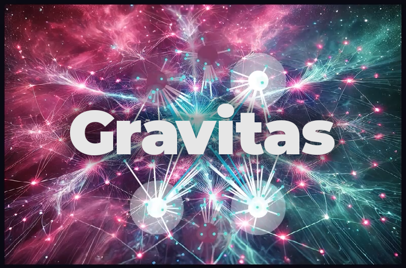
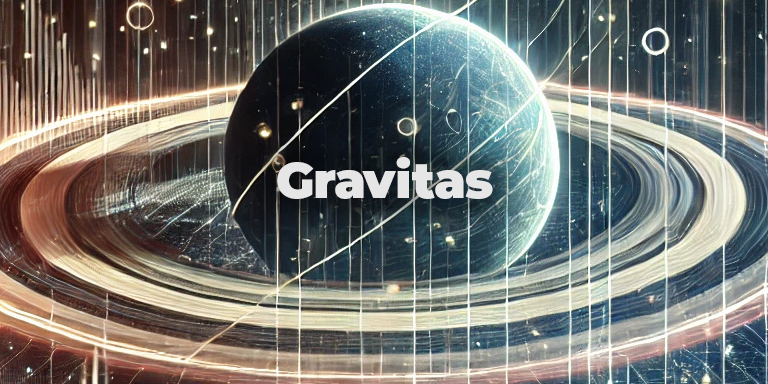

# SoL Gravitas

**Dynamic Gravitational Simulation with Gravitational Averaging (GA) and Biomimetic Gravitational Averaging (BGA)**

---

## Overview

SoL Gravitas is a cutting-edge simulation tool that visualizes complex gravitational systems using advanced computational models. By leveraging principles like **Gravitational Averaging (GA)** and **Biomimetic Gravitational Averaging (BGA)**, the simulation produces dynamic, realistic behaviors that mimic cosmic phenomena such as planetary formation, swarm behavior, and distributed systems.

The visualization offers a glimpse into how gravitational mechanics, when properly averaged and balanced, can drive emergent behaviors that scale from micro-interactions to large-scale cosmic equilibrium.

---

## Key Features

- **Dynamic Node Interaction:** Visualizes how smaller Dynamic Nodes (DNs) interact with larger Primary Mass Nodes (PMNs) based on gravitational forces.
- **Gravitational Averaging (GA):** Smooths gravitational influence across multiple PMNs, creating natural, emergent behavior that mimics orbital mechanics.
- **Biomimetic Gravitational Averaging (BGA):** Introduces the gravitational averaging formula to a computer science problem.
- **Filament Visualization:** Displays dynamic filaments representing gravitational connections and data pathways between nodes.
- **Interactive Controls:** Add or remove nodes, adjust mass, velocity, and toggle collision mechanics in real-time.
- **Sophisticated Collision Response:** Implements elastic collisions between nodes to simulate realistic mass interactions (present in the code but not active, though potentially useful for specific use cases).



---

## Gravitational Averaging (GA)

**Gravitational Averaging (GA)** ensures that each node's gravitational pull is not dominated by a single mass but is instead an aggregate of all surrounding PMNs. This creates smoother and more natural motion, preventing erratic behaviors and chaotic system collapses.

Mathematically, this is achieved by distributing the gravitational force across multiple nodes proportionally to their mass and distance:

```
F_total = Σ (G * m_1 * m_i) / d_i^2
```

Where:
- `G` is the gravitational constant.
- `m_1` is the mass of the Dynamic Node.
- `m_i` is the mass of the i-th Primary Mass Node.
- `d_i` is the distance between the Dynamic Node and the i-th PMN.

This smooth distribution prevents single PMNs from dominating and enables nodes to interact more naturally.

---

## Biomimetic Gravitational Averaging (BGA)

**Biomimetic Gravitational Averaging (BGA)** is a novel algorithmic approach for system optimization and data compression. Inspired by the self-organizing principles of gravitational systems, particularly the emergent behaviors seen in phenomena like Saturn’s rings, BGA leverages the concepts of distributed gravitational influence and harmonic gravitational sorting to enable dynamic load balancing, self-healing systems, and natural data compression. By mimicking the way gravitational systems achieve equilibrium through collective interactions, BGA provides an adaptive and efficient solution for managing complex, distributed computing environments.

**Formula:**
```
F_weighted = Σ [(m_i / d_i) * F_i] / Σ (m_i / d_i)
```

This ensures that nodes find natural equilibrium zones between competing gravitational sources, leading to:
- **Stable Orbital Dynamics**
- **Realistic Swarm Behavior**
- **Adaptive Gravitational Influence**


---

## Gravitas Recommendation Engine Protocol (GREP)

Gravitas (GREP) is a temporal system, meaning it processes recommendations and matches based on dynamic, real-time interactions rather than static datasets. This temporal nature offers both advantages and challenges, which merit discussion to provide a holistic view of its capabilities.

### **Advantages of Temporal Processing**
- **Adaptability:** Adjusts to changing datasets or user preferences dynamically.
- **Fair Load Distribution:** Avoids static hierarchies, ensuring equitable visibility for entities.
- **Responsive Interaction:** Delivers recommendations that feel immediate and personalized.

### **Challenges of Temporal Processing**
- **Computational Overhead:** Requires significant processing power for real-time updates.
- **Transient States:** May overlook long-term patterns in favor of immediate trends.
- **Scalability:** Balancing vast datasets in real-time remains a technical hurdle.

Gravitas represents a shift from static recommendation paradigms to dynamic, adaptive systems. While complex, its ability to model chaotic yet organized systems like gravitational mechanics offers a compelling alternative to traditional AI-driven approaches.


[Watch the video on YouTube](https://youtu.be/XEB_d5aLHbE?si=zrzj2Md8dj1x_xqF)

---

## Installation

1. **Clone the Repository:**
   ```bash
   git clone https://github.com/richfallatjr/gravitas.git
   cd gravitas
   ```

2. **Install Dependencies:**
   ```bash
   pip install -r requirements.txt
   ```

3. **Run the Simulation:**
   ```bash
   python main.py
   ```

---

## Controls

- **Add Dynamic Node (DN):** Adds a smaller, mobile node.
- **Add Primary Mass Node (PMN):** Adds a larger gravitational node.
- **Mass Slider:** Adjusts the mass of newly created nodes.
- **Velocity Slider:** Adjusts the starting velocity of nodes.
- **Enable/Disable Collisions:** Toggles collision detection between DNs and PMNs.
- **Start Simulation:** Begins the gravitational simulation.

---

## Future Roadmap

- **Adaptive Gravitational Filaments:** Introduce dynamic adjustment of filament strength based on system load (ideal for computational models).
- **Resource Queueing Systems:** Implement repulsion mechanisms to mimic load balancing in distributed computing.
- **Real-Time Parameter Adjustment:** Sliders to adjust gravitational constants, softening factors, and force limits during simulation.

---

## License

This project is licensed under a non-commercial license. See the [LICENSE](LICENSE) file for details.

---

## Acknowledgments

This project is inspired by astrophysical phenomena and theoretical models of gravitational systems, adapted for interactive simulation and computational visualization.

---

## Contact

For questions, contributions, or collaborations:
- **Email:** info@losangelesmercantile.com
- **GitHub:** [richfallatjr](https://github.com/richfallatjr)
- **Discord:** [SoL (Speed of Light)](https://discord.gg/kjRc93BY)

---


*SoL Gravitas: Harnessing the elegance of gravitational forces to visualize balance in chaos.*
